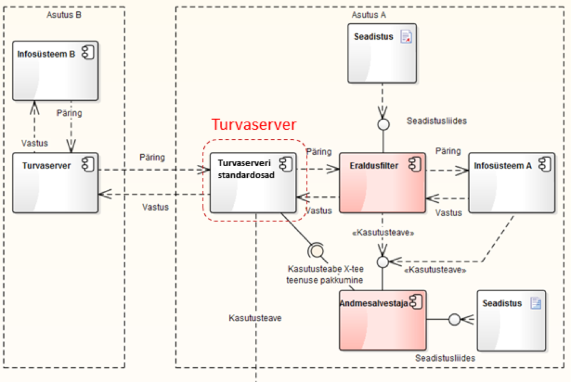
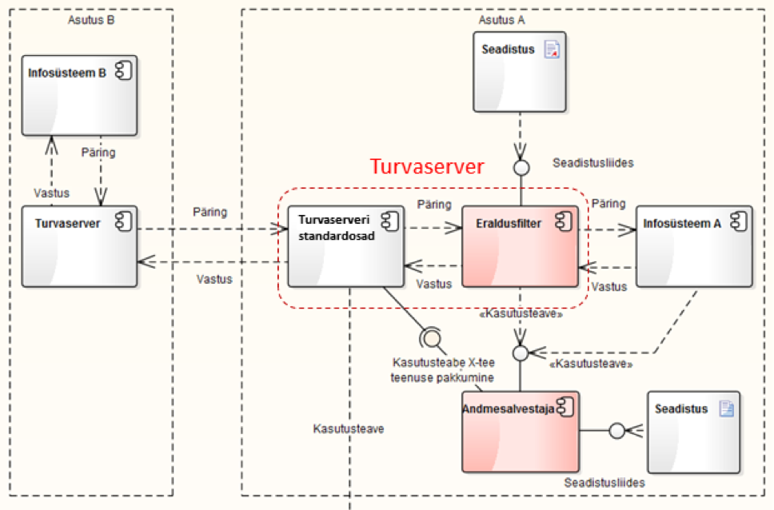

# Andmejälgija eraldusfiltri disainilahendus

X-tee andmejälgija analüüs ja disain

Versioon 1.0, 20.12.2015

Tellija: Riigi Infosüsteemi Amet

Täitja: Degeetia OÜ, Mindstone OÜ ja FocusIT OÜ

## 1. Dokumendi ajalugu

| Versioon | Kuupäev | Autor | Märkused |
| --- | --- | --- | --- |
| 1.0 | 20.12.2015 | Tanel Tammet | Esimene versioon |

## 2. Sisukord

  * [1\. Dokumendi ajalugu](#1-dokumendi-ajalugu)
  * [2\. Sisukord](#2-sisukord)
  * [3\. Sissejuhatus](#3-sissejuhatus)
  * [4\. Süsteemi taust](#4-s%C3%BCsteemi-taust)
    * [4\.1\. Ülevaade eraldusfiltrist andmejälgija komponendina](#41-%C3%9Clevaade-eraldusfiltrist-andmej%C3%A4lgija-komponendina)
    * [4\.2\. Ülevaade X\-tee turvaserveri tehnoloogia olulistest punktidest](#42-%C3%9Clevaade-x-tee-turvaserveri-tehnoloogia-olulistest-punktidest)
  * [5\. Komponentdiagramm](#5-komponentdiagramm)
    * [5\.1\. Diagramm eraldusfiltri asukohast eraldiseisva proxyna](#51-diagramm-eraldusfiltri-asukohast-eraldiseisva-proxyna)
    * [5\.2\. Diagramm eraldusfiltri asukohast turvaserveri sees nn pistikrakendusena](#52-diagramm-eraldusfiltri-asukohast-turvaserveri-sees-nn-pistikrakendusena)
  * [6\. Andmekogu ja eraldusfiltri vastavus](#6-andmekogu-ja-eraldusfiltri-vastavus)
  * [7\. Eraldusfiltri arhitektuurilised / funktsionaalsed põhimõtted](#7-eraldusfiltri-arhitektuurilised--funktsionaalsed-p%C3%B5him%C3%B5tted)
  * [8\. Eraldusfiltri tehnoloogilised põhimõtted](#8-eraldusfiltri-tehnoloogilised-p%C3%B5him%C3%B5tted)
  * [9\. Eraldusfiltri konfigureerimine](#9-eraldusfiltri-konfigureerimine)
  * [10\. Plussid ja miinused eraldusfiltri paigaldamisel turvaserveri sisse vs turvaserverist välja](#10-plussid-ja-miinused-eraldusfiltri-paigaldamisel-turvaserveri-sisse-vs-turvaserverist-v%C3%A4lja)

## 3. Sissejuhatus

Käesolev dokument kajastab tarkvaralise lahenduse "Andmejälgija" ühe komponendi - eraldusfiltri -  arhitektuurilist ülesehitust ja tehnilist kontseptsiooni, esitades seejuures ühe konkreetse ettepaneku, mis ei ole veel RIA poolt kinnitatud. Seega on võimalik, et siin väljapakutud eraldusfiltri ülesehitus läheb muutmisele.

Dokument on suunatud arendajatele, kellel on tarvis realiseerida  eraldusfilter.

## 4. Süsteemi taust

Esitame taustana kõigepealt lühiülevaate eraldusfiltrist ja siis pikemalt olulised punktid X-tee turvaserverist, mis on tähtsad eraldusfiltri realisatsiooni piirangute ja valikute aspektist.

Mõtleme siin X-tee turvaserveri all eraldi serverit  / virtuaalserverit / Linuxi paigaldust, kuhu on paigaldatud ja kus töötab X-tee turvaserveri tarkvara. Viimane sisaldab terve hulga baastarkvara ja komponente. Paigalduspaketti ennast me siin dokumendis "turvaserveriks" ei nimeta.

### 4.1. Ülevaade eraldusfiltrist andmejälgija komponendina

Andmejälgija kui terviku eesmärk, funktsionaalsus ja arhitektuuriline ülesehitus on detailselt kirjeldatud eraldi dokumendis "Andmejälgija täiendatud tehniline kontseptsioon".

Eraldusfilter on osa andmejälgijast, jälgib andmekogu X-tee liiklust ning võimaldab minimaalse arendus- ja paigaldustööga logida andmekogust X-teele saadetud (ja paigaldaja soovi korral ka laekunud) isikuandmete liikumise fakte: mis isiku andmed liikusid, mis andmekogust mis andmekogusse, mis oli päring ehk andmete liikumise lühieesmärk.

Eraldusfilteron mõteldud isikuandmete liikumise salvestamiseks X-teel:

- üldjuhul väljaminevate isikuandmete jaoks, kuid peab olema võimalik konfigureerida ka sissetulnud andmete salvestamist.
- Eraldusfilter  on küll andmejälgija standardkomponent, kuid tema paigaldamine andmejälgijas ei ole kohustuslik.
- Eraldusfiltri saab paigaldada proxyna nii turvaserveri sisse (väikese koormusega turvaserveritel) kui proxyna turvaserveri ja infosüsteemi vahele (suure koormusega turvaserveritel).

### 4.2. Ülevaade X-tee turvaserveri tehnoloogia olulistest punktidest

Mõtleme siin X-tee turvaserveri all eraldi serverit / virtuaalserverit / Linuxi paigaldust, kuhu on paigaldatud ja kus töötab X-tee turvaserveri tarkvara. Viimane sisaldab terve hulga baastarkvara ja komponente. Paigalduspaketti ennast me siin dokumendis "turvaserveriks" ei nimeta.

Praegu on kasutusel turvaserveri versioon 5. Lähiajal asutakse juurutama versiooni 6: see protsess on mittetriviaalne. Juurutusperioodi pikkus on raskelt ennustatav. Lähemas tulevikus jäävad paralleelselt toimima nii versioon 5 kui 6.

Olulisi tehnoloogilisi tähelepanekuid:

- Turvaserveri seni kasutusel 5 versioon ja  6 versioon on küllalt erineva koodibaasiga ja erineva tehnoloogilise ülesehitusega.
- Versioon 6 sisaldab Postgresql andmebaasi sõnumite ajutiseks salvestamiseks: pikemaajaliseks salvestamiseks kantakse kirjed logifaili. Ajutiselt hoitakse päringuid Postgresql andmebaasis ca 1 päev. Andmebaasi salvestatud päringud sisaldavad kogu sõnumite infot peale manuste.
- Versioon 6 Postgresql andmebaas on Margus Freudenthali hinnangul edukalt kasutatav ka muuks andmesalvestamiseks peale hetkel logi ajutise salvestamise.
- Versioon 5 jaoks eksisteerib RIA lehel eraldi paigalduspakett monitooringu jaoks, kuid versioon 6 jaoks sellist alles ehitatakse (ehitaja peamiselt Soome pool). Viimane funktsioneerib, liidestudes versioon 6 akka actorsi süsteemiga, mis annab edasi sõnumi metainfot, kuid mitte selle sisu.
- Versioon 5 päringuvastused sisaldavad mh algset päringut (sh siis ka võimalikku isikukoodi) kuid versioon 6-l sellist nõuet ei ole: näiteks on võimalik olukord, et isikukood saadetakse päringuna, kuid vastuses isikukoodi ei ole.
- Nii versioon 5 kui versioon 6 päring ja vastus sisaldavad ID välja, mille abil vastuse saab päringuga kokku panna.
- Versioon 5 ei nõua süntaktiliselt korrektset WSDL faili (ehk, seda saab ignoreerida) kuid versioon 6 nõuab.
- Versioon 6 jaoks on loodud turvaserverisse sisse paigaldatav proxy, mis otsustab, kas sissetulev sõnum on versioon 6 või versioon 5 jaoks, ning suunab sõnumi vastavasse keskkonda. Kõik need komponendid on sama turvaserveri sees.
- Versioon 6 (ja ilmselt ka 5) sisend-väljund-pordid on ümberkonfigureeritavad.
- Versioon 6 (ja ilmselt ka 5) ei sisalda eraldi tulemüüri, mis takistaks näiteks mingite kõrgemate portide kasutamist.

## 5. Komponentdiagramm

Eraldusfiltri väljapakutud lahendus on olla proxy infosüsteemi ja turvaserveri vahel. Seejuures saab teda paigaldada kahel eri moel:

- Eraldusfilter on turvaserverist **eraldiseisev nn proxy** , millega infosüsteem liidestub ja mis suunab sõnumid edasi turvaserverile.
- Eraldusfilter on on **turvaserveri sees olev proxy** : pordid välismaailmaga on samad, mis turvaserveril seni, kuid sisemiselt suunab liiklust edasi teistele turvaserveri portidele (need saab ja tuleb sel juhul ümber konfigureerida)

### 5.1. Diagramm eraldusfiltri asukohast eraldiseisva proxyna

Proxy asendab infosüsteemi jaoks hetkel käigusolevat turvaserverit ning suunab infosüsteemilt tulnud sõnumid turvaserverile ja turvaserverilt tulnud sõnumid infosüsteemile.

### 5.2. Diagramm eraldusfiltri asukohast turvaserveri sees nn pistikrakendusena

See variant on sarnane eraldiseisvale proxyle, kuid paigaldatakse turvaserveri sisse ja kasutab infosüsteemiga suhtlemiseks samu porte, mida turvaserver seni kasutas. Analoogiliselt suunab infosüsteemilt tulnud sõnumid turvaserverile ja turvaserverilt tulnud sõnumid infosüsteemile.

## 6. Andmekogu ja eraldusfiltri vastavus

Eraldusfiltrit paigaldades lähtutakse põhimõttest, et üks eraldusfilter teenindab ainult ühte andmekogu ja on seotud üheainsa andmesalvestajaga. Küll aga võib:

- Üks andmekogu kasutada mitut eraldusfiltrit: see juhtub olukorras, kus andmekogu kasutab (näiteks koormuse jaotamiseks) mitut X-tee turvaserverit. Iga sellise turvaserveri ja andmekogu vahele tuleb paigutada eraldi eraldusfilter, kas siis turvaserveri sisse või turvaserveri ja andmekogu vahele.
- Mitu andmekogu võivad jagada ühte ja sama X-tee turvaserverit, mis võib olla paigaldatud näiteks teenusepakkuja majutusse. Sel puhul paigaldatakse eraldusfilter iga andmekogu jaoks eraldi, turvaserveri ja andmekogu vahele.

## 7. Eraldusfiltri arhitektuurilised / funktsionaalsed põhimõtted

Eraldusfilter realiseeritakse proxyna viisil, et:

- Kõik saabunud sõnumid salvestatakse eraldusfiltri mälus olevasse järjekorda edasiseks filtreerimiseks/töötlemiseks ja saadetakse seejärel koheselt edasi turvaserverile. Turvaserveri liiklusele tekitatav täiendav latentsus eraldusfiltri olemasolul ei tohi olla rohkem, kui 1 millisekund ühes suunas.
- Filtreerimine/töötlemine toimub eraldusfiltri järjekorras, kasutades eraldi lõime, juba peale sõnumi edasisaatmist X-tee turvaserverile / turvaserveri standardosadele.
- Eraldusfilter ei salvesta töö käigus vaheinformatsiooni kettale ega nö vaheandmebaasi: järjekord ja muu ajutine informatsioon hoitakse mälus.
- Eraldusfilter salvestab tuvastatud ja teisendatud sõnumi-info valmiskujul andmejälgija andmebaasi, kasutades selleks andmesalvesaja API-t. Salvestatud info on kujul, kus ta ei vaja edasist teisendamist  väljakuvamiseks eesti.ee portaalis või sisekasutuseks. Kõik eesti.ee-s kuvatavad tekstid salvestatakse juba kuvamiskujul andmejälgija andmebaasi.
- Eraldusfilter loeb käivitudes infot konfiguratsioonifailist ning monitoorib regulaarselt konfiguratsioonifaili muutuste osas N-sekundilise intervalliga, mis on toodud konfiguratsioonifailis. Töötavat eraldusfiltrit saab ümber konfigureerida ilma teda ümber käivitamata.
- Eraldusfiltri poolt kasutatav maksimaalne mälumaht peab olema konfiguratsioonis seatav.
- Vigade tekkimisel eraldusfiltris (näiteks, järjekorra täitumisel) jätkab eraldusfilter sõnumite edasisaatmist turvaserverile, ning:
  - Salvestab veateate omaenda vigade-logifaili, mille asukoht võetakse konfiguratsioonifailist
  - Teatab süsteemi haldurile e-postiga (e-post võetakse konfiguratsioonifailist) läbi andmejälgija muude komponentide veast.
- Eraldusfilter suhtleb X-tee turvaserveri ning asutuse andmekoguga (olukorras, kus eraldusfilter on paigutatud väljapoole turvaserverit) sama protokolliga, millega andmekogu esialgselt turvaserveriga suhtles: kui selleks oli http, siis kasutatakse ka eraldusfiltriga suhtlemisel HTTPd, kui selleks oli HTTPS, siis  kasutatakse ka eraldusfiltriga suhtlemisel HTTPSi.
- Eraldusfilter suhtleb andmesalvestajaga kas HTTP või HTTPS protokolliga: valiku teeb paigaldaja.

## 8. Eraldusfiltri tehnoloogilised põhimõtted

Eraldusfilter realiseeritakse Java keeles, kasutades Java Standard Edition (SE) selliselt, et tema paigaldamine nii turvaserveri sisse kui väljapoole turvaserverit oleks võimalikult lihtne ja ei tekitaks konflikte turvaserveri teekide / komponentidega.

Turvaserveri sisse paigaldamise alusena eeldatakse X-tee turvaserveri versiooni 6. Versioon 5 sisse paigaldamise võimaldamine on positiivne täiendav võimalus, kuid ei ole esmane eesmärk.

Eraldusfilter realiseeritakse turvaserveri versioon 6-s olemasolevat Java versiooni kasutades, kuid vältides tehnoloogiaid, mis ei tööta Java versioon 6-s. Põhjus selles, et eraldusfiltri paigutamisel väljapoole turvaserverit ei tekiks konflikte infosüsteemis olemasoleva Java versiooniga, mis võib olla versioon 6 või 7.

Eraldusfiltri realisatsioonis välditakse teekide kasutamist, mis ei ole olemas Java versioon 6 standardteegis. Tungiva vajaduse korral võib kasutada turvaserveri versioon 6-s olevaid teeke.

## 9. Eraldusfiltri konfigureerimine

Eraldusfiltri konfigureerimiseks kasutatakse konfiguratsioonifaili, mis paigutatakse samasse serverisse, kus eraldusfilter töötab.

Konfiguratsioonifail esitatakse XML-kujul failina.

Konfiguratsioonifailis esitatakse kaks blokki informatsiooni:

- Informatsioon turvaserveri töötamise üldparameetrite osas:
  - Maksimaalne kasutatav mälu
  - Andmejälgija andmebaasiga kirjutamiseks ühenduse võtmise parameetrid
  - Sissetulevate ja väljaminevate sõnumite pordid ja IP-aadressid
  - Muu vajalikuks osutuv
- Informatsioon monitooritavate sõnumite osas
  - Milliseid sõnumeid tuleb monitoorida
  - Iga sellise monitooritava sõnumitüübi kohta:
    - isikukoodi olemasolu / puudumine ja XPATH tema asukoha kohta sõnumis
    - muude andmejälgijasse salvestatavate andmeväljade jaoks kas (a) fikseeritud tekst või (b) XPATH avaldis vastava identifikaatori/teksti saamiseks sõnumist koos (vajadusel) teisendustabeliga, mis teisendab tehnilise koodi inimloetavaks tekstiks, mis on mõeldud esitamiseks eesti.ee-s.

## 10. Plussid ja miinused eraldusfiltri paigaldamisel turvaserveri sisse vs turvaserverist välja

Allpool toodud paigaldusvariandid on juhtöörid eraldusfiltri paigaldajale.

**Turvaserverist väljapoole paigaldamise variant:**

Plussid:

- Ei tekita nõudmisi/eeldusi turvaserveri ehituse osas.
- Ei lisa turvaserverile uut funktsionaalsust/keerukusi/turvariske.
- Ei koorma turvaserveri arvutit jõudluse osas.

Miinused:

- Nõuab rohkem andmekogu infosüsteemi konfiguratsioonide sättimist ja paigaldustöid, kui muud variandid: üldjuhul tekib vajadus suunata infosüsteemi turvaserverile mõeldud sõnumid teisele IP-aadressile/pordile, kui seni.
- Tekitab väikese viivituse sõnumite edasisaatmisel (nõuame suurusjärku maksimaalselt 1 millisekund), samas ei tekita piirangut läbilaskevõime osas.

**Turvaserveri sisse paigaldamise variant:**

Plussid:

- Konfigureerimis- ja paigaldustööd on lihtsad: infosüsteem suhtleb turvaserveriga täpselt nagu enne, muutusi tegema ei pea.

Miinused:

- Lisab turvaserverile uut funktsionaalsust/keerukusi/turvariske.
- Koormab turvaserveri arvutit jõudluse osas.
- Tekitab väga väikese viivituse sõnumite edasisaatmisel (oletame suurusjärku maksimaalselt 0.1 millisekundit), samas ilmselt ei tekita mingit piirangut läbilaskevõime osas, v.a. arvuti jõudluse kulutamine.
- Kui proxy läheb rikki, siis liiklus X-teega katkeb. Samas on see kergesti tuvastatav.
